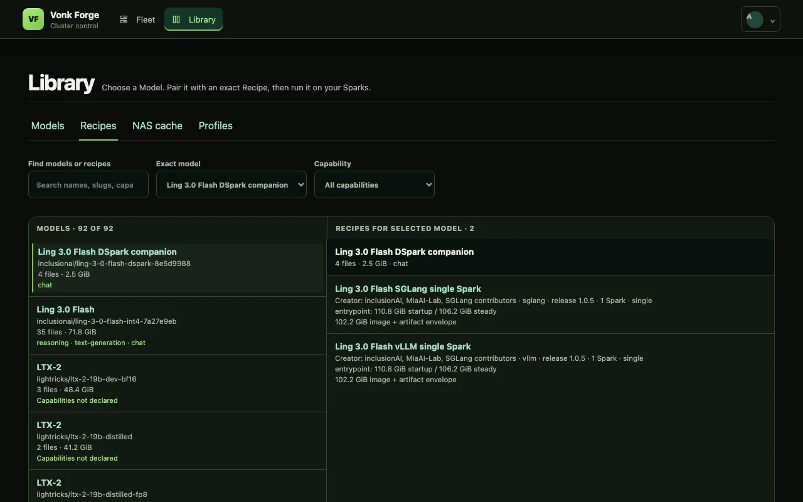
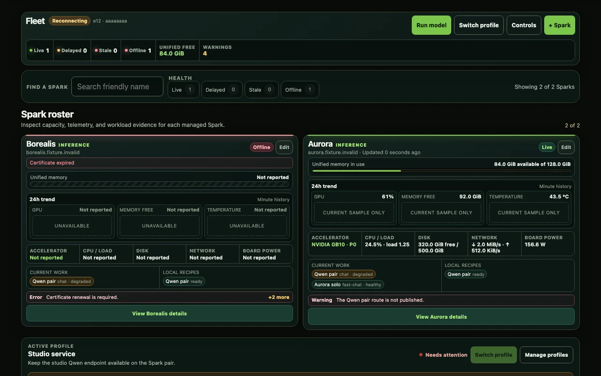
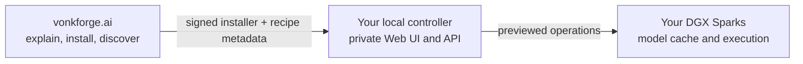

# Vonk Forge Web

**The public front door for local AI you operate yourself.**

This repository powers [`vonkforge.ai`](https://vonkforge.ai): the Vonk Forge
product site, installation guide, architecture explainer, and public recipe
catalog. It is a static site served by Cloudflare Pages; there is no backend. It helps an NVIDIA DGX Spark owner understand the system and get to a
local controller without pretending the public website is the controller.

[Open the website](https://vonkforge.ai) ·
[Install Vonk Forge](https://vonkforge.ai/install) ·
[Browse recipes](https://vonkforge.ai/recipes) ·
[Controller repository](https://github.com/CarstVaartjes/vonk-forge)

| Library: choose with exact model and lifecycle facts | Fleet: see capacity, placement, and blockers |
| --- | --- |
|  |  |

These are fixture-backed screenshots of the private Web Controller implemented
in `vonk-forge`; they contain no live fleet data.

## What visitors should understand

1. **What it is:** one local control plane for one or many NVIDIA DGX Sparks.
2. **Where it runs:** any local computer with Docker Compose, including a
   laptop, NAS, or server.
3. **How it works:** install the controller, enroll Sparks, choose a reproducible
   recipe, preview the plan, then confirm it.
4. **What stays private:** controller authority, identity, secrets, model
   caches, fleet state, and execution.


```mermaid
flowchart LR
    Website[vonkforge.ai<br/>explain, install, discover]
    Controller[Your local controller<br/>private Web UI and API]
    Sparks[Your DGX Sparks<br/>model cache and execution]

    Website -->|signed installer + recipe metadata| Controller
    Controller -->|previewed operations| Sparks
```

The public site reads immutable recipe metadata from the recipe library's
generated index. It stores nothing, does not control Sparks, execute workloads, accept model uploads, or hold runtime
secrets. Container images remain in registries; model weights remain at immutable
origins and in node-local caches.

## Site map

| Route | Job |
| --- | --- |
| `/` | Define the product, show the real interface, and lead to installation |
| `/install` | Explain the signed controller and Spark installation path |
| `/architecture` | Show public, controller, network, identity, and runtime boundaries |
| `/control` | Tour the private Web Controller and equivalent `vonkctl` path |
| `/models` | Browse public models and the recipes that run them |
| `/recipes` | Filter public immutable recipes by runtime, topology, and publisher |
| `/publish` | Point recipe authors to the reviewed GitHub workflow |
| `/privacy` | Disclose aggregate, cookie-free website analytics |

## Run the frontend

```bash
npm --prefix web ci
npm --prefix web run dev
```

The Vite development server prints its local URL.

## Static catalog

The Models and Recipes routes read one file: the `catalog-index.json` that
[`vonk-forge-recipes`](https://github.com/CarstVaartjes/vonk-forge-recipes)
generates from its reviewed recipe and model documents and publishes as an
asset of a signed GitHub release. Browsers cannot fetch release assets
cross-origin, so the Pages build copies it:
[`web/scripts/recipe-release.mjs`](web/scripts/recipe-release.mjs) downloads the
newest release whose tag major matches the supported recipe contract major (or
the tag in `VONK_RECIPE_RELEASE`). It downloads only that release's single
`recipe-library.tar` asset (an uncompressed tar of flat files: `SHA256SUMS`, its
Sigstore bundle and every file `SHA256SUMS` lists), refuses any member that is
not a unique flat regular file, verifies `SHA256SUMS`
against its Sigstore attestation from the library's `publish.yml` on `main`,
checks every bundle file and the index against `SHA256SUMS`, and writes
`web/public/catalog/` (`catalog-index.json`, `release.json`, `SHA256SUMS` and its
bundle). The browser reads only those same-origin files. Package download links
point at the verified release's `recipe-library.tar` on GitHub (the package is one
member of it; packages are not copied to Pages because some exceed its 25 MiB per-file limit).

The library's release tag is its contract version (for example `v2.0.0`).
Recipe changes do not create a new release: the library updates that release's
assets in place and records `updated_at` in the index, which the site shows
beside the library version. Publishing a recipe is a pull request against the
recipe library; the hourly Pages build picks up the updated release. For local
development with the real catalog, run `node web/scripts/recipe-release.mjs`
first (requires an authenticated `gh`).

## Checks

```bash
npm --prefix web ci
npm --prefix web audit --audit-level=high
npm --prefix web test -- --run
npm --prefix web run build
npm --prefix web run test:e2e   # builds, serves web/dist, and runs Playwright
```

The end-to-end suite runs against the production bundle with `vite preview` and
serves a fixture release at `/catalog/` in place of the verified one.

## Deployment

Cloudflare Pages serves `web/dist` at [`vonkforge.ai`](https://vonkforge.ai)
(default hostname `vonk-forge-web.pages.dev`). Every push to `main` runs
[`pages.yml`](.github/workflows/pages.yml), which runs CI ([`ci.yml`](.github/workflows/ci.yml)) and, once it passes, builds the frontend and uploads
it with Wrangler. `web/public/_headers` and `web/public/_redirects` supply the
security headers, asset caching, and SPA fallback. See
[`docs/operations/cloudflare-pages.md`](docs/operations/cloudflare-pages.md).

Signed controller packages and installers are published from `vonk-forge` at
`packages.vonkforge.ai`, not from this repository.

## Related repositories

- [`vonk-forge`](https://github.com/CarstVaartjes/vonk-forge) — local controller,
  Web UI, native Spark agent, installers, CLI, and operator documentation.
- [`vonk-forge-recipes`](https://github.com/CarstVaartjes/vonk-forge-recipes) —
  public standard library of immutable model/runtime recipes.
